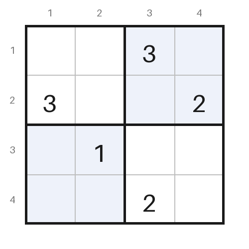
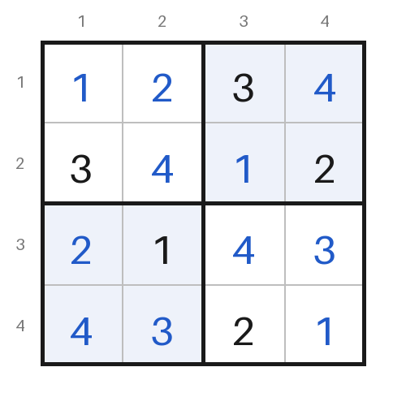
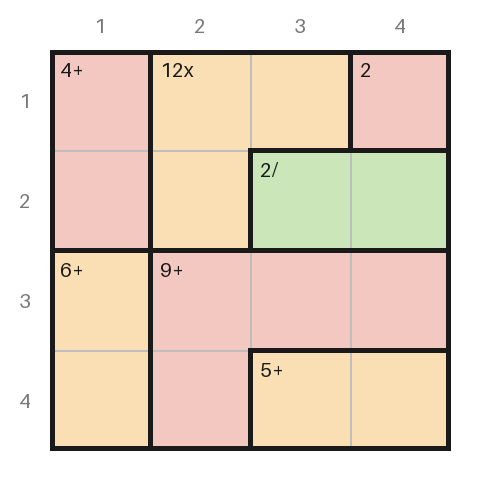
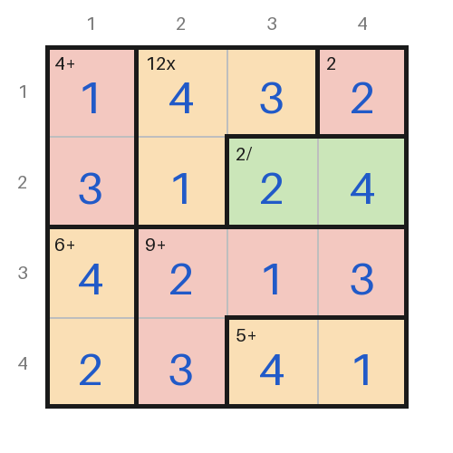
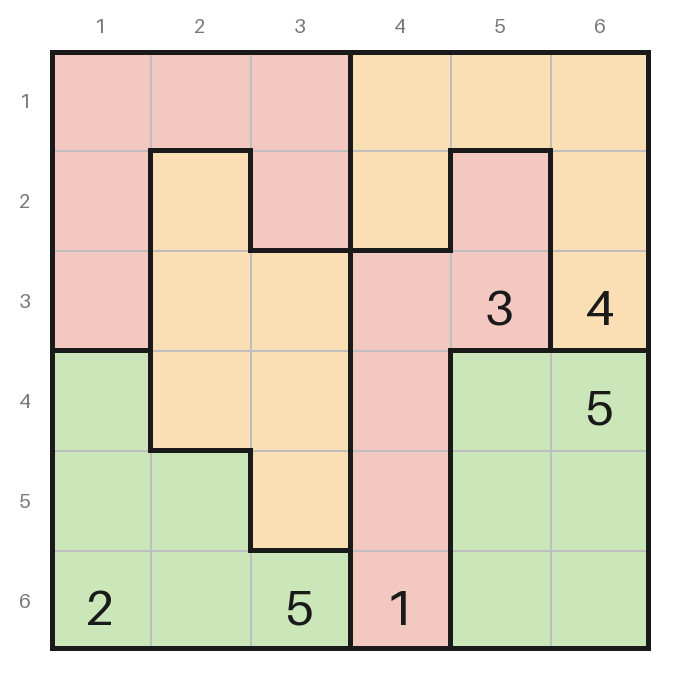
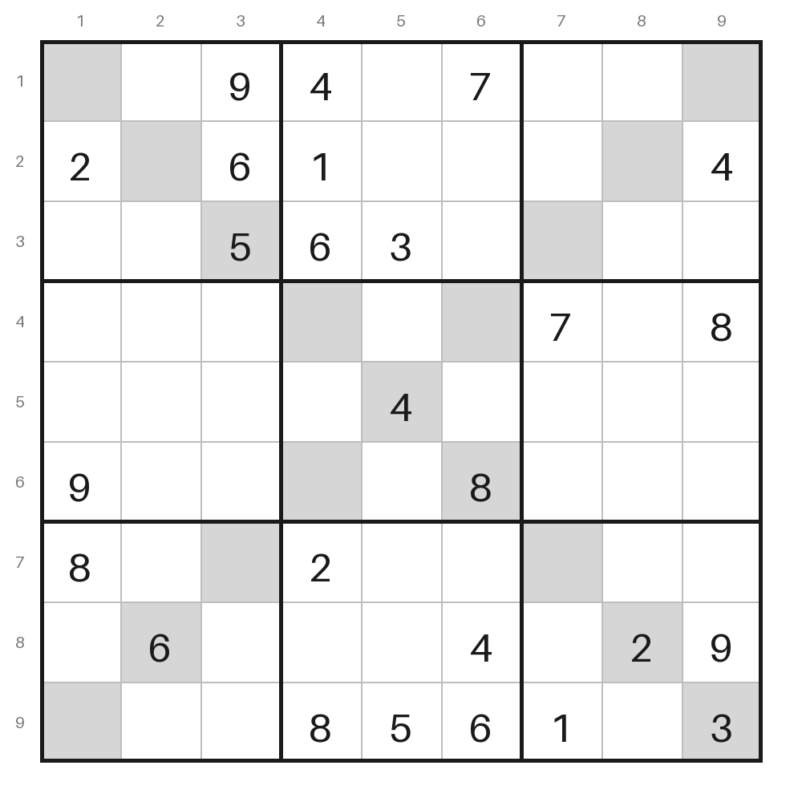
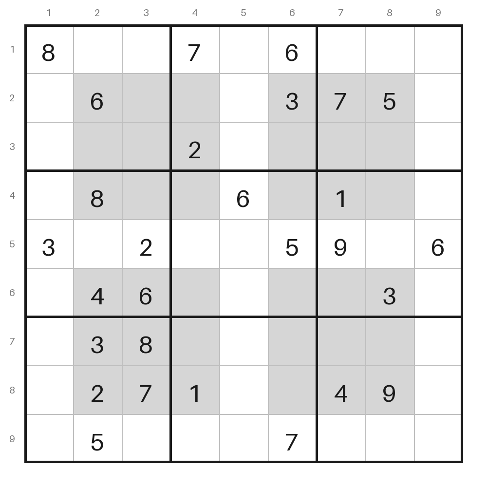
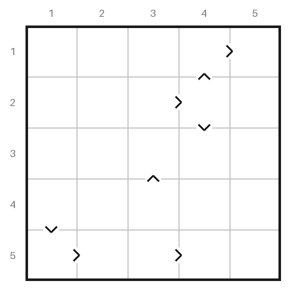

# prrrove

**Solves logic puzzles the way a person would, and writes down how.**

One small constraint engine, several puzzle families: **Murdoku** (any size),
**Sudoku** (with Jigsaw, X-Sudoku and NRC variants), **Calcudoku/KenKen** and
**Futoshiki**. Each puzzle is compiled down to literals
and constraints, and solved by named deduction rules — no search — so every
step can be explained. The rules never learn which puzzle they are solving.

## A first case

Four people on a 4 × 4 floor plan with three rooms. Everyone stands in a
different row and a different column. Trees, bushes, tables and cabinets
block their square; chairs and the bed can be sat or lain on. "Next to"
means directly above, below, left or right, *in the same room*.

<table>
<tr>
<td></td>
<td>

**Clues**

1. Ingrid is on a chair.
2. Joost is next to the tree.
3. Lotte is on the bed.

**Wouter**, the victim, is in the last free square.
He was alone with his murderer.

### Who did it?

</td>
</tr>
</table>

<details>
<summary><b>Show the solution</b>, as written by <code>--explain</code></summary>

<br>

- **The direct clues.** Ingrid is on a chair (1): r3c1, r3c4 or r4c3. Joost
  is next to the tree (2): **Joost on r1c1**. Lotte is on the bed (3): r4c1
  or r4c2.
- **Lotte, Ingrid and Wouter.** Joost takes column 1, so **Lotte on r4c2**.
  Lotte takes row 4 and Joost takes column 1, so **Ingrid on r3c4**. Only
  r2c3 is left for Wouter: **Wouter on r2c3**.


Wouter is in the sitting room, and the only other person there is
**Ingrid**. She did it.

</details>

Both pictures and the solution text are generated from
[`examples/murdoku_intro.txt`](examples/murdoku_intro.txt):

```bash
./solve.sh examples/murdoku_intro.txt --png board.png   # board.png, board-solution.png
./solve.sh examples/murdoku_intro.txt --explain         # the worked solution above
```

## Also Sudoku, Calcudoku and Futoshiki

The same engine, with the same kind of pictures. Givens are black; what the
solver fills in is blue.

<table>
<tr>
<th>Mini Sudoku</th>
<th>Calcudoku</th>
</tr>
<tr>
<td>Every row, column and 2 × 2 box holds 1–4 once.</td>
<td>Every row and column holds 1–4 once. Each cage's numbers make its
target with its sign: <code>9+</code> adds up to 9, <code>12x</code>
multiplies to 12, <code>2/</code> divides to 2.</td>
</tr>
<tr>
<td>
</td>
<td>
</td>
</tr>
</table>

```bash
./solve.sh examples/sudoku_4x4.txt --png sudoku.png           # sudoku.png, sudoku-solution.png
./solve.sh examples/calcudoku_4x4_easy.txt --png calcudoku.png
```

### Variants by generalising, not by new code

Many puzzle variants are an existing puzzle with its rules *generalised*:
more groups that must hold every digit once, or a different shape for them.
The engine never knew what a box was in the first place, so a variant is
only a few lines in the puzzle file and the compiler, with no new deduction
rule:

- **Jigsaw Sudoku**: boxes of any shape (`Boxes:`).
- **X-Sudoku**: the two main diagonals are houses too. They are written as
  two extra houses (below); the centre cell is on both.
- **NRC Sudoku** (also sold as Hyper Sudoku or Windoku), from the Dutch
  newspaper: four extra grey 3 × 3 boxes, overlapping the nine ordinary
  ones, follow the same rule (`Extra:`). Any other set of extra houses
  works the same way, X-Sudoku's diagonals included.
- **Futoshiki** is a Calcudoku without cages: the same Latin square, with
  one two-cell relation ("smaller than") per sign.

<table>
<tr>
<th>Jigsaw Sudoku</th>
<th>X-Sudoku</th>
<th>NRC Sudoku</th>
<th>Futoshiki</th>
</tr>
<tr>
<td></td>
<td></td>
<td></td>
<td></td>
</tr>
</table>

The X-Sudoku and the NRC Sudoku would each have two solutions without their
extra houses. A Futoshiki sign, being a two-cell relation, also gives
`chains` its links: the Futoshiki above has no givens at all and needs
`chains`.

Sudoku is 4 × 4 or 9 × 9, Jigsaw Sudoku and Futoshiki 4 × 4 to 9 × 9,
Calcudoku any size.

## What else it does

- **Explains itself.** `--explain` writes a short worked solution, in English
  or Dutch, citing clues by number and describing where people can be by
  room, row or column rather than listing squares. `--step` redraws the board
  after every deduction; `--show-model` shows what the engine sees.
- **Checks itself.** `--brute-force` solves by plain search, sharing nothing
  with the engine, to confirm a puzzle has exactly one solution. Every
  example is checked this way, and so is every single deduction the solver
  makes on it.
- **Grades puzzles** by the hardest rule they need (`--grade`), from
  `single` up to `chains` and `what_if`.
- **Draws the puzzle** (`--png`): Murdoku with region colours, icons and name
  tags; Sudoku, Calcudoku and Futoshiki with boxes, cages, targets and signs.

```bash
./solve.sh examples/prrrdoku3.txt --explain        # a 9 × 9 with three cats, in Dutch
./solve.sh examples/prrrdoku1.txt --step           # watch it deduce, step by step
./solve.sh examples/sudoku_swordfish.txt --verbose
./solve.sh examples/calcudoku_6x6_hard.txt --show-model
```

Requires Python 3.12+. The solver has no runtime dependencies; `--png` needs
Pillow (`uv sync --extra png`).

## Command line

`./solve.sh <puzzle file> [options]` (or `uv run csp <puzzle file> [options]`). The puzzle type is
detected from the file; `--type sudoku|murdoku|calcudoku|futoshiki` overrides that.

| Option | What it does |
|---|---|
| *(none)* | Solve by deduction and print the start and end boards. |
| `--verbose`, `-v` | Narrate each deduction: the rule, what it placed or ruled out, and why. |
| `--step`, `-s` | Narrate, redraw the board, and wait for Enter after each deduction. Murdoku crosses out squares nobody can reach and lists whose options narrowed; Calcudoku and Futoshiki show the numbers still possible in each cell, like pencil marks. What changed is drawn in blue. |
| `--show-model` | Explain what the engine sees, then stop: variables, constraint families, how literals and constraints overlap, what the clues settled at compile time, each relation, and the rule ladder. The quickest way into the design. |
| `--brute-force` | Find the solutions by plain search instead of deduction, then stop. Exit code 0 if there is exactly one, 1 if there are none or several (it shows two and where they differ). The check to run after transcribing a puzzle. |
| `--explain` | Murdoku only: write out a short worked solution, as Markdown bullets, in the puzzle's language. See [Worked solutions](#worked-solutions). |
| `--grade` | Print only the puzzle's grade: the hardest rule the solve needed (`single` ... `chains`, `what_if`), or `unsolved`. |
| `--png FILE` | Draw the puzzle as a picture in FILE, and once solved the solution in FILE with `-solution` added (`board.png`, `board-solution.png`). Combines with the other options. |

Every solve ends with a summary such as `rules used: single 54, cover2 2;
grade: cover2`. Without `--brute-force` the exit code is 0 when the puzzle
is solved, 1 when the rules run out or hit a contradiction, and 2 when the
file cannot be read.

## Examples

| File | Needs |
|---|---|
| `sudoku_4x4.txt` | `single` only: the mini Sudoku above |
| `sudoku_easy.txt` | `single` only |
| `sudoku_pointing.txt` | `subsumption` (pointing pair) |
| `sudoku_naked_pair.txt`, `sudoku_hidden_pair.txt`, `sudoku_xwing.txt` | `cover2` |
| `sudoku_swordfish.txt` | `cover3` |
| `sudoku_chains.txt` | `chains` |
| `sudoku_x.txt` | `single` only, but it uses the diagonals: without them it has two solutions |
| `sudoku_jigsaw.txt` | `cover2`: a 6×6 with irregular boxes |
| `sudoku_nrc.txt` | `single` only, but it uses its four grey boxes: without them it has two solutions |
| `futoshiki_5x5.txt` | `chains`: no givens, eight signs |
| `murdoku_intro.txt` | `single` only: the 4×4 first case above |
| `murdoku_house.txt` | `relations`, `subsumption`: a 5×5 using "not next to" and a counting clue |
| `prrrdoku1.txt` | `relations`, `subsumption` |
| `prrrdoku2.txt` | `cover2`, `cover3`, `chains` |
| `prrrdoku3.txt` | `chains`, `what_if` |
| `calcudoku_4x4_easy.txt`, `calcudoku_6x6_medium.txt` | `relations` (cage arithmetic) |
| `calcudoku_6x6_hard.txt` | `cover2` |
| `calcudoku_6x6_fiendish.txt` | `what_if` |
| `calcudoku_7x7_hard.txt` | `cover3` |

`prrrdoku1-3.txt` are transcribed from a set of Dutch puzzle documents (not
in this repo), with cats among the suspects. The graded Sudokus and their
variants, the Calcudokus and the Futoshiki are generated (newspaper puzzles
are copyrighted) and picked
because each needs the rule listed. Every one has exactly one solution.

## The model

Three ingredients, defined in `src/csp/core.py`:

- **Literals** — atomic choices. `r3c4=7` for Sudoku or Calcudoku,
  `Tim=r1c1` for Murdoku.
- **Constraints** — a set of literals tagged `EXACTLY_ONE` or `AT_MOST_ONE`,
  optionally labelled with the *family* it belongs to ("each digit once per
  row"); the label only serves explanations.
- **Relations** — a predicate over two or more variables' choices, for clues
  like "Jos is somewhere left of Otto" or "Luna is furthest from Mao", and
  for Calcudoku cages ("these three cells add up to 12").

A *variable* is just a constraint flagged as owning a whole domain, so
`model.chosen("Tim")` can report what Tim settled on.

The `EXACTLY_ONE` / `AT_MOST_ONE` split is load-bearing, not decoration.
`AT_MOST_ONE` forbids a second truth but never forces a first. Collapsing the
two is exactly the bug that made an earlier version of this code unsound on
Murdoku: with 7 people over 43 squares, most squares stay empty, so "this
square is only possible for Vladimir" says nothing at all.

## How the puzzles map

| | Sudoku | Murdoku | Calcudoku | Futoshiki |
|---|---|---|---|---|
| Variable | a cell | a **person** | a cell | a cell |
| Literal | cell holds digit | person stands on square | cell holds number | cell holds number |
| `EXACTLY_ONE` | cell holds one digit | person stands somewhere | cell holds one number | cell holds one number |
| | digit once per row / col / box (/ extra house) | one person per row; one per column | number once per row / col | number once per row / col |
| `AT_MOST_ONE` | — | square holds at most one person | — | — |
| Relations | — | position, distance and region clues; see [Puzzle files](#puzzle-files) | one per cage: its arithmetic | one per sign: smaller < larger |

A Calcudoku is a Sudoku without boxes plus one relation per cage. The cage
relation also requires distinct numbers where its cells share a row or
column, so arc consistency rules out "3+3" inside a line without help.
A Futoshiki is the same Latin square with one two-cell relation per sign.
Jigsaw boxes and extra houses (X-Sudoku diagonals, NRC boxes) are more
`EXACTLY_ONE` families, built
from one list of the puzzle's houses that the compiler, the brute force and
the pictures all share.

Murdoku's variables are people rather than squares because that is the shape
of the rules: "exactly one figure per row" puts seven figures on a 7x7 board,
it does not put all seven in every row. Modelling it the Sudoku way (squares
choosing people) demands all seven people in each row and is unsatisfiable the
moment an object blocks a square.

## The rules

Applied cheapest-first; any success restarts the ladder.

| Rule | What it does |
|---|---|
| `single` | An `EXACTLY_ONE` with one option left forces it. |
| `relations` | Arc consistency: drop every value of a relation that no combination of the other variables' values supports. |
| `subsumption` | If `live(A) ⊆ live(B)` and A is `EXACTLY_ONE`, every B-literal outside A is false. |
| `cover2`, `cover3` | The same over *k* constraints: *k* disjoint `EXACTLY_ONE`s whose live literals fit inside *k* others use those others up. |
| `chains` | Alternating inference chains. A *strong* link joins the last two options of an `EXACTLY_ONE` (one of them holds); a *weak* link joins two options that cannot both hold (they share a constraint, or a two-variable relation forbids the pair). Assume a start option false and follow strong and weak links in turn: an option reached as true means "the start or this one" holds, so anything weakly linked to both is false. |
| `what_if` | Assume a literal on a copy, run `single`/`relations`/`subsumption`; if that contradicts, the literal is false. Of the options it can refute, it takes the one with the shortest refutation. |

`single` covers Sudoku's naked single *and* hidden single with no
special-casing — they are the same statement about different constraints
("this cell holds one digit" vs "this digit sits once in this row").
`subsumption` is likewise pointing-pairs and box/line reduction at once.

`cover`*k* is naked subsets (As are cells), hidden subsets (As are
digit-in-house), X-Wing (*k*=2) and Swordfish (*k*=3) (As are digit-in-row,
Bs digit-in-column) — one rule, again with no special-casing.

`chains` is simple colouring, X- and XY-chains, Y- and W-wings and 3D
Medusa in one rule. Weak links from two-person clues and two-cell cages make
it work on Murdoku and Calcudoku as well. `--explain` tells a chain as "if
Otto is not on r6c5, then Otto is on r7c6, then Luna is not on r7c4 (row 7),
then Luna is on r8c3; so ...", with the reason for each link.

`what_if` is the case split a person does when stuck ("if Tim were on r2c3,
Jos would have nowhere to go"). It is last on the ladder and bounded: one
assumption, cheap rules only, no nested guessing. It looks at the variable
with the fewest options first and, of the values it can rule out there,
keeps the one whose contradiction comes quickest, so the explanation is as
short as it can be. Since `chains`, only
`prrrdoku3.txt` and the fiendish Calcudoku still need it.

### Related solvers

**A technique-by-technique solver.**
[Dedoku](https://github.com/n36l3c7/Dedoku) is a Sudoku solver with the same
philosophy: logic only, every step named and explained. It implements 20
technique families, each written for Sudoku's cells, rows and boxes, and it
inspired several things here: the `chains` rule, the step-by-step soundness
test, grading and the benchmark. Because this engine sees only literals and
exactly-one / at-most-one groups, many of those families are one rule here:

| Sudoku techniques | Here |
|---|---|
| Naked and hidden singles | `single` |
| Pointing and claiming (intersection removal) | `subsumption` |
| Naked and hidden pairs and triples, X-Wing, Swordfish | `cover2`, `cover3` |
| Simple colouring, X-Chain, XY-Chain, Y-Wing, W-Wing, 3D Medusa, AIC | `chains` |
| Quads, Jellyfish, finned fish, ALS-XZ, XYZ-Wing | not yet; see [Possible improvements](#possible-improvements) |
| Unique and Avoidable Rectangles, BUG | not planned: they assume the puzzle has exactly one solution, while every rule here must be sound for any model |

**A solver with no named techniques at all.**
[Demystify](https://github.com/stacs-cp/demystify), from the University of
St Andrews, is generic in a different way. Puzzles are written in a
constraint modelling language (Essence Prime), with an English description
attached to each constraint. At every step it searches, with a SAT solver,
for the smallest set of constraints that proves some cell value impossible
(a *minimal unsatisfiable subset*), takes the step with the smallest such
set, and explains it by listing those constraints. It covers many puzzle
types (Futoshiki, Kakuro, Skyscrapers, Star Battle, Binairo and more), and
its paper reports its steps matching published human solving guides about
89% of the time. This engine sits in between: named rules, cheap and
dependency-free, but none of them written for one puzzle.

## Verification

```bash
uv run pytest -q                        # 224 tests
uvx ruff check src tests benchmark      # lint
uvx ruff format --check src tests benchmark   # formatting
uv run mypy src                         # strict type check
```

GitHub Actions runs all four on every push to `main`, on Python 3.12 and
3.13.

Correctness is checked against ground truth, not self-consistency:

- **Brute force.** `csp.bruteforce` solves every puzzle family by plain
  backtracking, with no literals, constraints or deduction rules. It shares
  only the file readers and the puzzle's rule definitions (Calcudoku cage
  arithmetic, Murdoku clue `conditions`) with the engine, and a test checks
  it never imports `csp.core`. Every example must have exactly one
  brute-force solution, and the engine must find that same solution.
  `--brute-force` runs it from the command line; exit code 0 means the
  puzzle is unique, so it is the check to run after transcribing a puzzle.
- **Every step.** On every example, every placement and every elimination
  the solver logs, compile time included, is checked against the
  brute-force solution. A rule that ever removes a true option fails this.
- The graded Sudokus (`sudoku_pointing`, `_naked_pair`, `_hidden_pair`,
  `_xwing`, `_swordfish`, `_chains`) and Calcudokus must also show their
  named pattern in the log, and must stall when the ladder is cut just
  before their rule, so each example really exercises that rung.
- `prrrdoku1-3.txt` are checked against the published solutions and the
  puzzle's question (who is in Vladimir's region) in their source documents,
  and the post-clue candidate lists are compared against the lists quoted in
  each document's own worked solution. A mis-transcribed board fails the
  tests rather than quietly solving a different puzzle.
- Calcudoku solutions are also checked as properties: every row and column
  is a permutation, and every cage makes its target.

### Benchmark

`uv run python benchmark/run.py --count 30 --seed 42` generates seeded random
Sudokus, each made minimal (no given can go without losing uniqueness,
checked by brute force), then grades and times them:

| Grade | Puzzles | Median ms | Max ms |
|---|---:|---:|---:|
| `single` | 13 | 11.4 | 12.7 |
| `subsumption` | 7 | 20.3 | 33.9 |
| `cover2` | 1 | 19.6 | 19.6 |
| `chains` | 9 | 833.8 | 2006.1 |

All 30 are solved by logic. Without `chains`, `what_if` had to settle nine
of them; with it, none. Chains are the slow part: the links are rebuilt from
scratch every time the rule runs (see below).

## Puzzle files

Sudoku is a plain 4 × 4 or 9 × 9 grid; `.`/`0` are blanks, and `|`/`-` are
ignored. For the variants, put the grid under `Givens:` and add:

```
Givens:
. . . . 3 4      # any size 4 to 9 when Boxes: is given
...
Boxes:           # Jigsaw: a letter per cell; N boxes of N cells each
a a a b b b
a c a b d b
...
Extra:           # extra houses of N cells: per cell '.' or its house letters
x . . . . . . . y
. x . . . . . y .
...
. . . . xy . . . .
...
```

The `Extra:` above is X-Sudoku: diagonals `x` and `y`, the centre cell on
both. NRC Sudoku marks its four grey boxes `a` to `d` the same way; see
[examples/sudoku_x.txt](examples/sudoku_x.txt) and
[examples/sudoku_nrc.txt](examples/sudoku_nrc.txt).

Futoshiki is a grid of givens and dots, then one sign per line between
neighbouring cells (either way round):

```
Grid:
. . . . .
...
Signs:
r1c4 > r1c5
r1c4 < r2c4
```

Calcudoku names each cage with a letter on the grid, then gives its rule:

```
Size: 4
Grid:
a a b c
d e b c
d e f f
g h h i
Cages:
a: 3-          # difference; 2-cell cages only
b: 7+          # sum
c: 2/          # quotient, larger first; 2-cell cages only
h: 3x          # product; also *, ×
g: 4           # one-cell cage: the number itself
```

The typographic signs ×, − and ÷ are accepted as printed. Cages must be
connected, and every cage on the grid needs a rule.

Murdoku uses named sections — see `examples/prrrdoku*.txt`:

```
Size: 7
Language: nl    # optional; language of --explain (en or nl, default en)
Words:          # optional; how --explain names things
  water: in het water     # a region or group: where it is
  vuurtje: het vuurtje    # an object or furniture: what it is called
Regions:        # id: name [#RRGGBB], e.g. "a: keukenwinkel #FADFB5" (name without spaces)
Groups:         # optional; name: region region ...
Hatched:        # optional; regions or groups drawn hatched in pictures
Grid:           # region id per square, e.g. "a a b b c c c"
Objects:        # name: square... — blocks those squares; names may repeat
Furniture:      # optional; name: square... — can be stood on
People:         # one per line, count must equal Size
Rules:          # optional; clues that come with the board, not numbered
  outside Tim water
Clues:          # numbered 1, 2, ... in the order given
  next_to Tim klimwand               # beside any of the named things, same region
  not_next_to Ben lamp               # beside none of them
  knight_from Tim klimwand boulder   # a knight's move from any of them
  on Jos bank                        # on a piece of furniture
  in_region Jos keukenwinkel         # any number of regions or groups
  outside Pip water                  # none of the given regions or groups
  same_region Anna Jos
  different_region Anna Pip
  apart Luna Mao                # different regions that do not share a side
  above Otto Tjitske 1          # exactly 1 row above; omit n for anywhere above
  left_of Jos Otto
  within Tjitske Otto 4         # at most 4 orthogonal steps apart
  at_least Tim Pip 6            # at least 6 steps apart
  alone Luna                    # nobody else in Luna's region
  furthest Luna Mao             # Luna is strictly further from Mao than anyone
  exactly 1 in_region Ada study ; in_region Ben hall   # exactly n of these hold
```

`alone` and `furthest` expand to one relation per other person; `furthest`
is a three-way relation (Luna, Mao, that person).

`exactly n <clue> ; <clue> ...` counts simple clues (any of the one- and
two-person clues above). Together they may name at most three people: the
engine checks a relation by trying every combination of its people's
squares, which grows quickly.

There is no "two people next to each other" clue: with one person per row
and column, two people never share a side, so it could never hold.

`next_to` follows Murdoku's general rule that being next to something never
crosses a region boundary. Distance (`within`, `at_least`, `furthest`),
direction (`above`, `left_of`) and `knight_from` do cross regions.

### Worked solutions

`--explain` writes the kind of solution a puzzle booklet prints: one bullet
per placement (or run of placements), clues cited by number, and people's
options described by region, row, column or the things on the board, with
square numbers only when there are a few:

> **Tjitske.** Otto en Pip zijn in hetzelfde gebied (7). Otto zit in een
> klimgebied of op kantoor, dus Pip zit in een klimgebied of op kantoor.
> Luna is ergens boven Jos (10), dus Jos zit op r8k3 of r8k4 en Luna zit in
> rij 6 of 7. ... Luna kan alleen in kolom 1, daar kan verder niemand:
> **Tjitske op r5k2**.

It is built in three layers that never reach into each other:

1. The solver solves as usual; each logged step records structurally *why*
   (which constraints or relation, which placement, a what-if's trail).
2. `proof.shortest` turns each deduction into a replayable `Move` and drops
   moves, hardest (`what_if`) first, while the rest still solve the
   puzzle; placements of someone with one option left are free.
   `proof.essential` trims a what-if to the steps its contradiction needed.
3. `story` words what is left, in the language and words of the puzzle
   file. A test checks that every placement it states matches the brute
   force.

### Pictures

`--png` draws a Murdoku board from the puzzle file in the style of a printed
Murdoku: region colours (from `Regions:`, or a default palette), a darker shade
under objects, hatching where `Hatched:` says, thick lines between regions,
icons for objects and furniture, name tags for people, coordinates and a
legend. Because it is drawn from the same file the solver reads, the picture
cannot disagree with the puzzle. Sudoku, Calcudoku and Futoshiki pictures
share the look: thick lines around boxes or cages, alternate boxes shaded,
Jigsaw boxes and cages in pastels that never match a neighbour, each cage's
target in its corner, extra houses (X-Sudoku diagonals, NRC boxes) grey as
NRC prints them, and each Futoshiki sign
drawn as a chevron on the cell edge.

Icons are referenced, not stored in the repo: `src/csp/icons.py` maps object
names (Dutch and English, e.g. `koffer`/`suitcase`; `boom2` counts as `boom`)
to Unicode emoji code points, and the pictures come from Google's
[Noto Emoji](https://github.com/googlefonts/noto-emoji) (images under the
Apache License 2.0), pinned to one commit so a name always gives the same
picture. They are downloaded on first use into `~/.cache/csp-solver`
(override with `CSP_ICON_CACHE`). An object not in the catalogue, or any
object when offline, is drawn as its name. To add an object, add its name
and code point to `CATALOGUE`.

## Layout

```
src/csp/
  core.py        engine: literals, constraints, relations, rules, solver
  proof.py       a short replayable proof of a solve (any puzzle family)
  sudoku.py      Sudoku compiler + renderer, including Jigsaw, X-Sudoku and NRC
  calcudoku.py   Calcudoku/KenKen compiler + renderer with pencil marks
  futoshiki.py   Futoshiki compiler + renderer with pencil marks
  murdoku.py     Murdoku compiler + renderer + clue vocabulary and meaning
  story.py       --explain: Murdoku worked solutions, Dutch or English
  puzzlefile.py  file readers: section format, Murdoku boards, kind detection
  report.py      --show-model: a plain-text account of any compiled model
  cli.py         command line
  bruteforce/    --brute-force: plain search per puzzle family, no engine
  picture.py     --png: pictures of every puzzle type (Pillow)
  icons.py       object name -> Noto Emoji picture, fetched and cached on use
examples/        sudoku_*.txt, calcudoku_*.txt and futoshiki_*.txt (graded
                 by the rule they need), murdoku_*.txt, prrrdoku1-3.txt
benchmark/       run.py: grade and time generated Sudokus
docs/images/     the README's pictures, drawn by --png
tests/           test_solver.py, test_picture.py, test_story.py
.github/         CI workflow
```

## TODO

**Generate the whole puzzle document** from its puzzle file, not just the
pictures (`--png`) and the worked solution (`--explain`). Not done on
purpose for now: the hand-written clue wording ("Jos doet een dutje op een
bank", "nog steeds") has charm the templates lack. If it is ever wanted:

- **Already derivable:** board and solution pictures, the colour legend with
  hatched regions starred, board facts for the rules (size, regions, figures,
  1 × 2 banks), the clue list (template wording), the worked solution.
- **Add to the puzzle file:** `Title:`, free-text `Notes:` for puzzle-specific
  rules, `Cats:`, and optional per-clue text that overrides the template
  (e.g. `on Jos bank | Jos doet een dutje op een bank.`), so the charm stays.
- **Model the question** (`Question: lap Vladimir`) and compute the answer
  bullet from the solution, so the answer is checked like everything else.
- **Build it** in a new `booklet.py` behind `--docx FILE`, assembling what
  `puzzlefile`, `story` and `picture` already produce; core stays untouched
  and the layering test gets a line for it. Use `python-docx` as an optional
  extra (like Pillow), starting from one of the current documents as the
  style template.
- **Test** by generating all three and comparing their text with the
  local source documents (worked solutions aside).

**Writing puzzle files from plain-language clues** is left to an LLM: give
it the clue vocabulary under [Puzzle files](#puzzle-files) and the
sentences, and let it write the `Clues:` section. Then check the result
with `--explain`, which reads each clue back in words, and with
`--brute-force`, since a misread clue almost always gives no solution or
several. A hand-written sentence parser is not planned.

### Possible improvements

- **Counting constraints: the bigger investment, and the one that opens the
  most new puzzles.** The engine only knows "exactly one" and "at most one".
  Many grid puzzles count to other numbers: Star Battle (two stars per row,
  column and region), Binairo/Takuzu (as many 0s as 1s per line), Tents,
  Minesweeper ("three mines around this cell"), Nurikabe-style clues. A
  general `EXACTLY_K` / `AT_MOST_K` kind, with `single` generalised (k
  options left for k: all true; k already true: the rest false) and `cover`
  generalised to count capacities instead of one-each, would bring those in
  without any per-puzzle rule. Arc consistency over a relation can do it
  today in principle, but tries every combination and does not scale to a
  whole row. The work is in core: the new kind, its rules, chains' strong
  and weak links for it (a count of k gives no strong links unless k options
  remain), `proof` and the wording of `story` and `report`.
- **Big sum cages.** A Calcudoku cage is checked by trying every
  combination of its cells' numbers, which slows down sharply for cages of
  six or seven cells. Cheaper, human-style steps would help: *bounds*
  ("the other four cells need at least 10, so this one is at most 5") and
  *virtual cages* (a row adds up to 1 + 2 + ... + n, so the cells a row's
  cages leave over must make up the difference). Both would also open the
  door to Killer Sudoku and Kakuro.
- **Faster chains.** `chains` rebuilds every link each time it runs and
  searches from every start. Keeping the links between runs, and updating
  only what the last deduction changed, would cut most of that.
- **Weak links from bigger relations.** Only two-variable relations give
  weak links now. Cages of three or more cells, and three-person clues,
  could add them too ("these two values cannot both hold, whatever the
  third cell is"), which would let chains replace `what_if` on the fiendish
  Calcudoku.
- **More Sudoku-style patterns, generically.** `cover4` (quads, Jellyfish)
  already exists but is not on the ladder; *finned* covers (a cover that
  holds except for a few stray options, so anything clashing with all of
  them goes) and *almost* covers (k groups fitting in k + 1, as in ALS-XZ)
  would follow the same generic pattern.
- **A hybrid mode.** When the rules stall, finish with the brute force and
  mark those placements as guesses, so the path never hides how a value was
  found.
