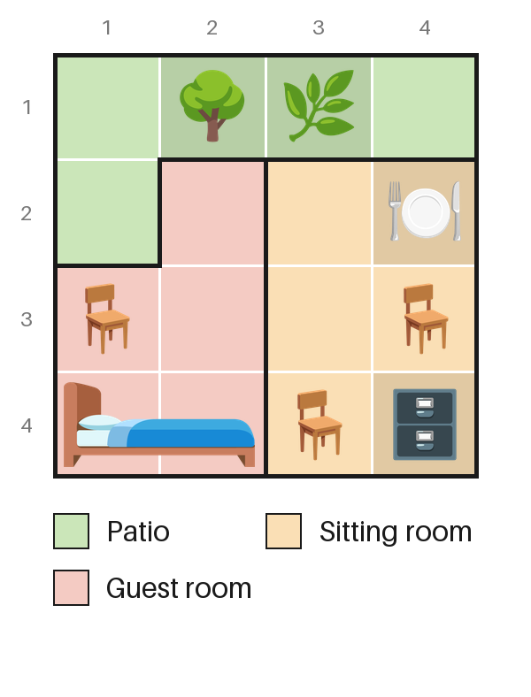
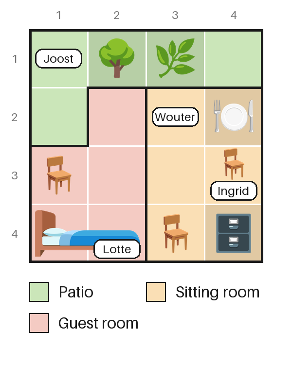

# prrrove

**Solves logic puzzles the way a person would, and writes down how.**

One small constraint engine, several puzzle families: **Murdoku** (any size),
**Sudoku** and **Calcudoku/KenKen**. Each puzzle is compiled down to literals
and constraints, and solved by named deduction rules — no search — so every
step can be explained. The rules never learn which puzzle they are solving.

## A first case

Four people on a 4 × 4 floor plan with three rooms. Everyone stands in a
different row and a different column. Trees, bushes, tables and cabinets
block their square; chairs and the bed can be sat or lain on. "Next to"
means directly above, below, left or right, *in the same room*.

<table>
<tr>
<td></td>
<td>

**Clues**

1. Ingrid is on a chair.
2. Joost is next to the tree.
3. Lotte is on the bed.

**Wouter**, the victim, is in the last free square.
He was alone with his murderer.

### Who did it?

</td>
</tr>
</table>

<details>
<summary><b>Show the solution</b>, as written by <code>--explain</code></summary>

<br>

- **The direct clues.** Ingrid is on a chair (1): r3c1, r3c4 or r4c3. Joost
  is next to the tree (2): r1c1. Lotte is on the bed (3): r4c1 or r4c2.
- **The rest.** **Joost on r1c1**. Joost takes column 1, so **Lotte on
  r4c2**. Lotte takes row 4 and Joost takes column 1, so **Ingrid on r3c4**.
  Only r2c3 is left for Wouter: **Wouter on r2c3**.



Wouter is in the sitting room, and the only other person there is
**Ingrid**. She did it.

</details>

Both pictures and the solution text are generated from
[`examples/murdoku_intro.txt`](examples/murdoku_intro.txt):

```bash
./solve.sh examples/murdoku_intro.txt --png board.png   # board.png, board-solution.png
./solve.sh examples/murdoku_intro.txt --explain         # the worked solution above
```

## What else it does

- **Explains itself.** `--explain` writes a short worked solution, in English
  or Dutch, citing clues by number and describing where people can be by
  room, row or column rather than listing squares. `--step` redraws the board
  after every deduction; `--show-model` shows what the engine sees.
- **Checks itself.** `--brute-force` solves by plain search, sharing nothing
  with the engine, to confirm a puzzle has exactly one solution. Every
  example is checked this way, and every placement `--explain` states is
  checked against it.
- **Draws the board** (`--png`) with region colours, icons and name tags.

```bash
./solve.sh examples/prrrdoku3.txt --explain        # a 9 × 9 with three cats, in Dutch
./solve.sh examples/prrrdoku1.txt --step           # watch it deduce, step by step
./solve.sh examples/sudoku_swordfish.txt --verbose
./solve.sh examples/calcudoku_6x6_hard.txt --show-model
```

Requires Python 3.12+. The solver has no runtime dependencies; `--png` needs
Pillow (`uv sync --extra png`).

## Command line

`./solve.sh <puzzle file> [options]` (or `uv run csp <puzzle file> [options]`). The puzzle type is
detected from the file; `--type sudoku|murdoku|calcudoku` overrides that.

| Option | What it does |
|---|---|
| *(none)* | Solve by deduction and print the start and end boards. |
| `--verbose`, `-v` | Narrate each deduction: the rule, what it placed or ruled out, and why. |
| `--step`, `-s` | Narrate, redraw the board, and wait for Enter after each deduction. Murdoku crosses out squares nobody can reach and lists whose options narrowed; Calcudoku shows the numbers still possible in each cell, like pencil marks. What changed is drawn in blue. |
| `--show-model` | Explain what the engine sees, then stop: variables, constraint families, how literals and constraints overlap, what the clues settled at compile time, each relation, and the rule ladder. The quickest way into the design. |
| `--brute-force` | Find the solutions by plain search instead of deduction, then stop. Exit code 0 if there is exactly one, 1 if there are none or several (it shows two and where they differ). The check to run after transcribing a puzzle. |
| `--explain` | Murdoku only: write out a short worked solution, as Markdown bullets, in the puzzle's language. See [Worked solutions](#worked-solutions). |
| `--png FILE` | Murdoku only: draw the board as a picture in FILE, and once solved the solution in FILE with `-solution` added (`board.png`, `board-solution.png`). Combines with the other options. |

Without `--brute-force` the exit code is 0 when the puzzle is solved, 1 when
the rules run out or hit a contradiction, and 2 when the file cannot be read.

## Examples

| File | Needs |
|---|---|
| `sudoku_easy.txt` | `single` only |
| `sudoku_pointing.txt` | `subsumption` (pointing pair) |
| `sudoku_naked_pair.txt`, `sudoku_hidden_pair.txt`, `sudoku_xwing.txt` | `cover2` |
| `sudoku_swordfish.txt` | `cover3` |
| `sudoku_what_if.txt` | `what_if` |
| `murdoku_intro.txt` | `single` only: the 4×4 first case above |
| `prrrdoku1.txt` | `relations`, `subsumption` |
| `prrrdoku2.txt` | `cover2`, `cover3`, `what_if` |
| `prrrdoku3.txt` | `what_if`, many times |
| `calcudoku_4x4_easy.txt`, `calcudoku_6x6_medium.txt` | `relations` (cage arithmetic) |
| `calcudoku_6x6_hard.txt` | `cover2` |
| `calcudoku_6x6_fiendish.txt` | `what_if` |
| `calcudoku_7x7_hard.txt` | `cover3` |

`prrrdoku1-3.txt` are transcribed from a set of Dutch puzzle documents (not
in this repo), with cats among the suspects. The graded Sudokus and the
Calcudokus are generated (newspaper puzzles are copyrighted) and picked
because each needs the rule listed. Every one has exactly one solution.

## The model

Three ingredients, defined in `src/csp/core.py`:

- **Literals** — atomic choices. `r3c4=7` for Sudoku or Calcudoku,
  `Tim=r1c1` for Murdoku.
- **Constraints** — a set of literals tagged `EXACTLY_ONE` or `AT_MOST_ONE`,
  optionally labelled with the *family* it belongs to ("each digit once per
  row"); the label only serves explanations.
- **Relations** — a predicate over two or more variables' choices, for clues
  like "Jos is somewhere left of Otto" or "Luna is furthest from Mao", and
  for Calcudoku cages ("these three cells add up to 12").

A *variable* is just a constraint flagged as owning a whole domain, so
`model.chosen("Tim")` can report what Tim settled on.

The `EXACTLY_ONE` / `AT_MOST_ONE` split is load-bearing, not decoration.
`AT_MOST_ONE` forbids a second truth but never forces a first. Collapsing the
two is exactly the bug that made an earlier version of this code unsound on
Murdoku: with 7 people over 43 squares, most squares stay empty, so "this
square is only possible for Vladimir" says nothing at all.

## How the puzzles map

| | Sudoku | Murdoku | Calcudoku |
|---|---|---|---|
| Variable | a cell | a **person** | a cell |
| Literal | cell holds digit | person stands on square | cell holds number |
| `EXACTLY_ONE` | cell holds one digit | person stands somewhere | cell holds one number |
| | digit once per row / col / box | one person per row; one per column | number once per row / col |
| `AT_MOST_ONE` | — | square holds at most one person | — |
| Relations | — | position, distance and region clues; see [Puzzle files](#puzzle-files) | one per cage: its arithmetic |

A Calcudoku is a Sudoku without boxes plus one relation per cage. The cage
relation also requires distinct numbers where its cells share a row or
column, so arc consistency rules out "3+3" inside a line without help.

Murdoku's variables are people rather than squares because that is the shape
of the rules: "exactly one figure per row" puts seven figures on a 7x7 board,
it does not put all seven in every row. Modelling it the Sudoku way (squares
choosing people) demands all seven people in each row and is unsatisfiable the
moment an object blocks a square.

## The rules

Applied cheapest-first; any success restarts the ladder.

| Rule | What it does |
|---|---|
| `single` | An `EXACTLY_ONE` with one option left forces it. |
| `relations` | Arc consistency: drop every value of a relation that no combination of the other variables' values supports. |
| `subsumption` | If `live(A) ⊆ live(B)` and A is `EXACTLY_ONE`, every B-literal outside A is false. |
| `cover2`, `cover3` | The same over *k* constraints: *k* disjoint `EXACTLY_ONE`s whose live literals fit inside *k* others use those others up. |
| `what_if` | Assume a literal on a copy, run `single`/`relations`/`subsumption`; if that contradicts, the literal is false. |

`single` covers Sudoku's naked single *and* hidden single with no
special-casing — they are the same statement about different constraints
("this cell holds one digit" vs "this digit sits once in this row").
`subsumption` is likewise pointing-pairs and box/line reduction at once.

`cover`*k* is naked subsets (As are cells), hidden subsets (As are
digit-in-house), X-Wing (*k*=2) and Swordfish (*k*=3) (As are digit-in-row,
Bs digit-in-column) — one rule, again with no special-casing.

`what_if` is the case split a person does when stuck ("if Tim were on r2c3,
Jos would have nowhere to go"). It is last on the ladder and bounded: one
assumption, cheap rules only, no nested guessing.

Not implemented: chains. See `AGENT.md`.

## Verification

```bash
uv run pytest -q                        # 140 tests
uvx ruff check src tests                # lint
uvx ruff format --check src tests       # formatting
uv run mypy src                         # strict type check
```

Correctness is checked against ground truth, not self-consistency:

- **Brute force.** `csp.bruteforce` solves every puzzle family by plain
  backtracking, with no literals, constraints or deduction rules. It shares
  only the file readers and the puzzle's rule definitions (Calcudoku cage
  arithmetic, Murdoku clue `conditions`) with the engine, and a test checks
  it never imports `csp.core`. Every example must have exactly one
  brute-force solution, and the engine must find that same solution.
  `--brute-force` runs it from the command line; exit code 0 means the
  puzzle is unique, so it is the check to run after transcribing a puzzle.
- The graded Sudokus (`sudoku_pointing`, `_naked_pair`, `_hidden_pair`,
  `_xwing`, `_swordfish`, `_what_if`) and Calcudokus must also show their
  named pattern in the log, and must stall when the ladder is cut just
  before their rule, so each example really exercises that rung.
- `prrrdoku1-3.txt` are checked against the published solutions and the
  puzzle's question (who is in Vladimir's region) in their source documents,
  and the post-clue candidate lists are compared against the lists quoted in
  each document's own worked solution. A mis-transcribed board fails the
  tests rather than quietly solving a different puzzle.
- Calcudoku solutions are also checked as properties: every row and column
  is a permutation, and every cage makes its target.

## Puzzle files

Sudoku is a plain grid; `.`/`0` are blanks, and `|`/`-` are ignored.

Calcudoku names each cage with a letter on the grid, then gives its rule:

```
Size: 4
Grid:
a a b c
d e b c
d e f f
g h h i
Cages:
a: 3-          # difference; 2-cell cages only
b: 7+          # sum
c: 2/          # quotient, larger first; 2-cell cages only
h: 3x          # product; also *, ×
g: 4           # one-cell cage: the number itself
```

The typographic signs ×, − and ÷ are accepted as printed. Cages must be
connected, and every cage on the grid needs a rule.

Murdoku uses named sections — see `examples/prrrdoku*.txt`:

```
Size: 7
Language: nl    # optional; language of --explain (en or nl, default en)
Words:          # optional; how --explain names things
  water: in het water     # a region or group: where it is
  vuurtje: het vuurtje    # an object or furniture: what it is called
Regions:        # id: name [#RRGGBB], e.g. "a: keukenwinkel #FADFB5" (name without spaces)
Groups:         # optional; name: region region ...
Hatched:        # optional; regions or groups drawn hatched in pictures
Grid:           # region id per square, e.g. "a a b b c c c"
Objects:        # name: square... — blocks those squares; names may repeat
Furniture:      # optional; name: square... — can be stood on
People:         # one per line, count must equal Size
Rules:          # optional; clues that come with the board, not numbered
  outside Tim water
Clues:          # numbered 1, 2, ... in the order given
  next_to Tim klimwand               # beside any of the named things, same region
  knight_from Tim klimwand boulder   # a knight's move from any of them
  on Jos bank                        # on a piece of furniture
  in_region Jos keukenwinkel         # any number of regions or groups
  outside Pip water                  # none of the given regions or groups
  same_region Anna Jos
  different_region Anna Pip
  apart Luna Mao                # different regions that do not share a side
  above Otto Tjitske 1          # exactly 1 row above; omit n for anywhere above
  left_of Jos Otto
  within Tjitske Otto 4         # at most 4 orthogonal steps apart
  at_least Tim Pip 6            # at least 6 steps apart
  alone Luna                    # nobody else in Luna's region
  furthest Luna Mao             # Luna is strictly further from Mao than anyone
```

`alone` and `furthest` expand to one relation per other person; `furthest`
is a three-way relation (Luna, Mao, that person).

`next_to` follows Murdoku's general rule that being next to something never
crosses a region boundary. Distance (`within`, `at_least`, `furthest`),
direction (`above`, `left_of`) and `knight_from` do cross regions.

### Worked solutions

`--explain` writes the kind of solution a puzzle booklet prints: one bullet
per placement (or run of placements), clues cited by number, and people's
options described by region, row, column or the things on the board, with
square numbers only when there are a few:

> **Tjitske.** Otto en Pip zijn in hetzelfde gebied (7). Otto zit in een
> klimgebied of op kantoor, dus Pip zit in een klimgebied of op kantoor.
> Luna is ergens boven Jos (10), dus Jos zit op r8k3 of r8k4 en Luna zit in
> rij 6 of 7. ... Luna kan alleen in kolom 1, daar kan verder niemand:
> **Tjitske op r5k2**.

It is built in three layers that never reach into each other:

1. The solver solves as usual; each logged step records structurally *why*
   (which constraints or relation, which placement, a what-if's trail).
2. `proof.shortest` turns each deduction into a replayable `Move` and drops
   moves, hardest (`what_if`) first, while the rest still solve the
   puzzle; placements of someone with one option left are free.
   `proof.essential` trims a what-if to the steps its contradiction needed.
3. `story` words what is left, in the language and words of the puzzle
   file. A test checks that every placement it states matches the brute
   force.

### Pictures

`--png` draws a Murdoku board from the puzzle file in the style of a printed
Murdoku: region colours (from `Regions:`, or a default palette), a darker shade
under objects, hatching where `Hatched:` says, thick lines between regions,
icons for objects and furniture, name tags for people, coordinates and a
legend. Because it is drawn from the same file the solver reads, the picture
cannot disagree with the puzzle.

Icons are referenced, not stored in the repo: `src/csp/icons.py` maps object
names (Dutch and English, e.g. `koffer`/`suitcase`; `boom2` counts as `boom`)
to Unicode emoji code points, and the pictures come from Google's
[Noto Emoji](https://github.com/googlefonts/noto-emoji) (images under the
Apache License 2.0), pinned to one commit so a name always gives the same
picture. They are downloaded on first use into `~/.cache/csp-solver`
(override with `CSP_ICON_CACHE`). An object not in the catalogue, or any
object when offline, is drawn as its name. To add an object, add its name
and code point to `CATALOGUE`.

## Layout

```
src/csp/
  core.py        engine: literals, constraints, relations, rules, solver
  proof.py       a short replayable proof of a solve (any puzzle family)
  sudoku.py      Sudoku compiler + renderer
  calcudoku.py   Calcudoku/KenKen compiler + renderer with pencil marks
  murdoku.py     Murdoku compiler + renderer + clue vocabulary and meaning
  story.py       --explain: Murdoku worked solutions, Dutch or English
  puzzlefile.py  file readers: section format, Murdoku boards, kind detection
  report.py      --show-model: a plain-text account of any compiled model
  cli.py         command line
  bruteforce/    --brute-force: plain search per puzzle family, no engine
  picture.py     --png: Murdoku board pictures (Pillow)
  icons.py       object name -> Noto Emoji picture, fetched and cached on use
examples/        sudoku_*.txt and calcudoku_*.txt (graded by the rule they
                 need), murdoku_intro.txt, prrrdoku1-3.txt
docs/images/     the README's pictures, drawn by --png
tests/           test_solver.py, test_picture.py, test_story.py
```

## TODO

**Generate the whole puzzle document** from its puzzle file, not just the
pictures (`--png`) and the worked solution (`--explain`). Not done on
purpose for now: the hand-written clue wording ("Jos doet een dutje op een
bank", "nog steeds") has charm the templates lack. If it is ever wanted:

- **Already derivable:** board and solution pictures, the colour legend with
  hatched regions starred, board facts for the rules (size, regions, figures,
  1 × 2 banks), the clue list (template wording), the worked solution.
- **Add to the puzzle file:** `Title:`, free-text `Notes:` for puzzle-specific
  rules, `Cats:`, and optional per-clue text that overrides the template
  (e.g. `on Jos bank | Jos doet een dutje op een bank.`), so the charm stays.
- **Model the question** (`Question: lap Vladimir`) and compute the answer
  bullet from the solution, so the answer is checked like everything else.
- **Build it** in a new `booklet.py` behind `--docx FILE`, assembling what
  `puzzlefile`, `story` and `picture` already produce; core stays untouched
  and the layering test gets a line for it. Use `python-docx` as an optional
  extra (like Pillow), starting from one of the current documents as the
  style template.
- **Test** by generating all three and comparing their text with the
  local source documents (worked solutions aside).
